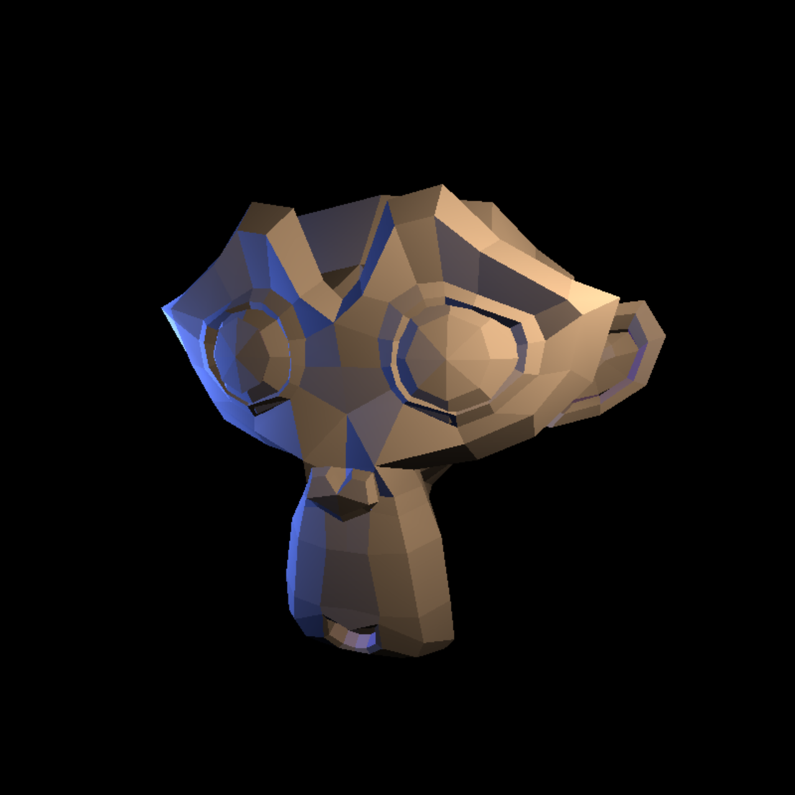

# Raytracer

A raytracer built from scratch in C++ as a learning project. No graphics engine, no shortcuts — just math and pixels.



## Features

- Ray-triangle intersection using the Möller-Trumbore algorithm
- Lambertian (diffuse) shading with inverse square law falloff
- Smooth shading via vertex normal interpolation
- Colored point lights (as many as you want)
- OBJ file loading (triangles and quads)
- Configurable camera with position, look-at and focal length
- SDL2 graphical output with resolution scaling
- TOML-based scene configuration

## Dependencies

- g++
- SDL2 (`sdl2-config` must be available)
- [toml++](https://github.com/marax27/tomlplusplus) (included in the repo)

### Installing SDL2

**Fedora:**
```
sudo dnf install SDL2-devel
```

**Ubuntu/Debian:**
```
sudo apt install libsdl2-dev
```

## Build

```
make
```

## Usage

```
./out -c config.toml
```

### Scene configuration

Scenes are defined in TOML files:

```toml
[camera]
position = [0.5, 0.3, 2]
look_at = [0, 0, 0]
focal_length = 1

[render]
width = 800
height = 800
scale = 1

[[lights]]
position = [2, 1, 2]
color = [1, 0.8, 0.6]

[[lights]]
position = [-2, 0, 1]
color = [0.3, 0.4, 0.8]

[model]
file = "./3d_files/Suzanne.obj"
```
